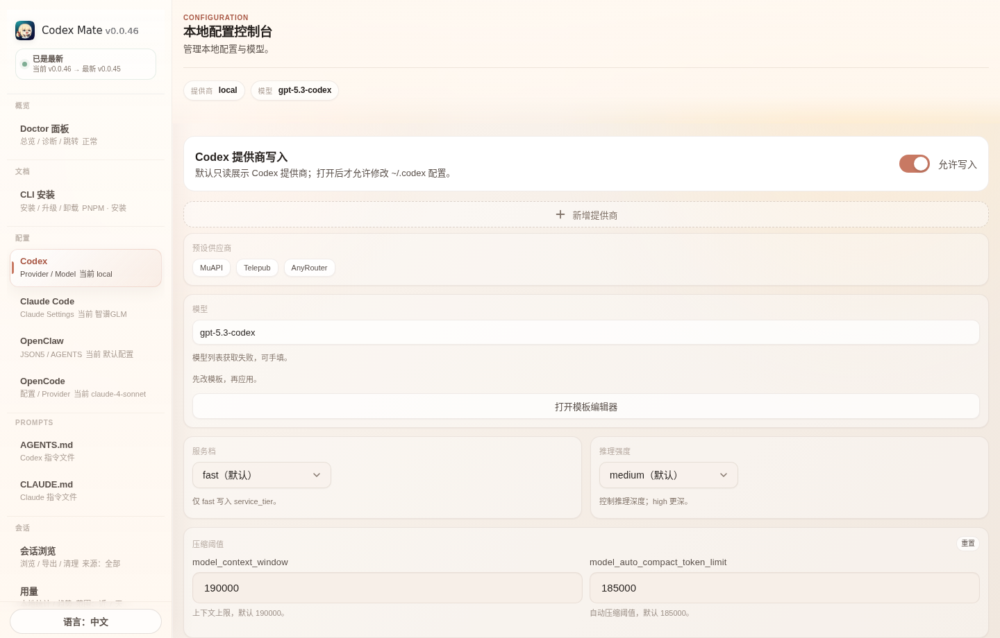
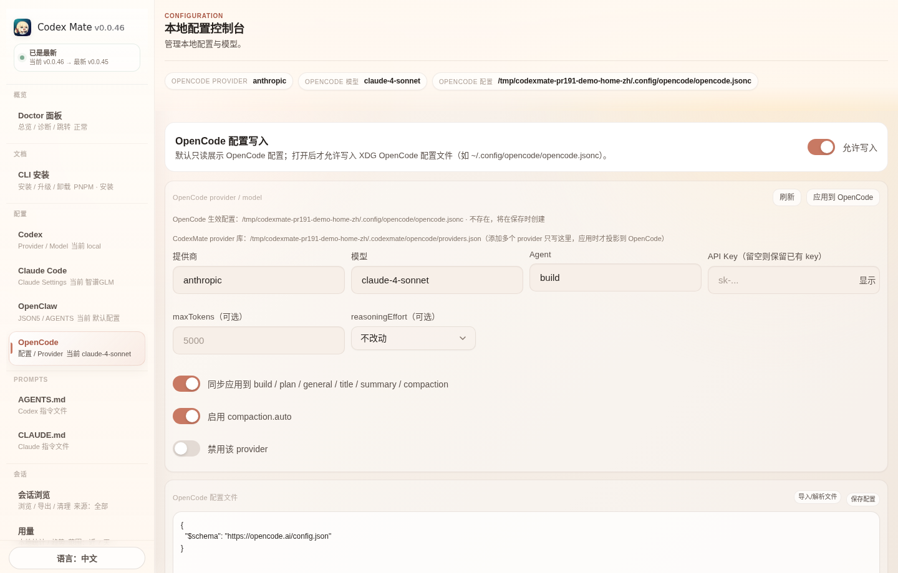
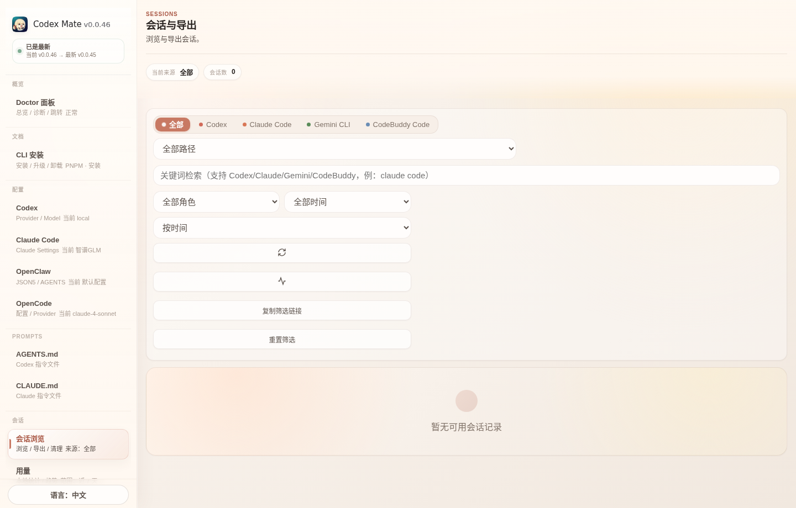
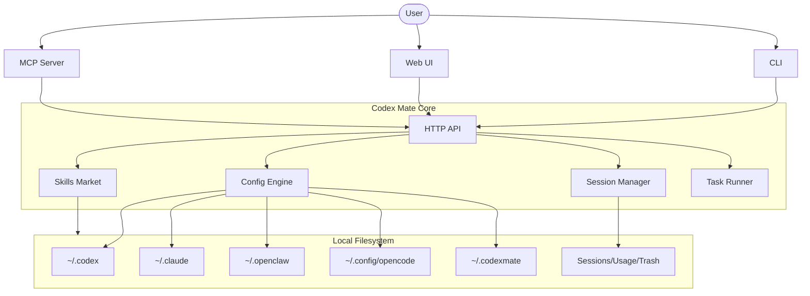

<div align="center">


# Codex Mate

**One dashboard for all your local AI coding agents. Switch providers, manage sessions, and orchestrate tasks across Codex, Claude Code, OpenCode, and OpenClaw. Zero cloud, local-first control plane.**

<p>
  <a href="https://sakurabytecore.github.io/codexmate/">[Documentation]</a>
  <a href="#quick-start">[Quick Start]</a>
  <a href="README.zh.md">[简体中文]</a>
</p>

[](https://www.npmjs.com/package/codexmate)
[](https://github.com/SakuraByteCore/codexmate/actions/workflows/release.yml)
[](https://www.npmjs.com/package/codexmate)
[](#install-via-homebrew-macos--linux)
[](#quick-start)
[](https://nodejs.org/)
[](LICENSE)
[](https://github.com/SakuraByteCore/codexmate/stargazers)
[](https://github.com/SakuraByteCore/codexmate/issues)

<br />

<p>
  
</p>
<p>
  
</p>
<p>
  
</p>

</div>

---

> [!TIP]
> **Local First**: All configurations and sessions are stored in your home directory. No telemetry, no cloud accounts required.

> [!IMPORTANT]
> This project is currently in early stage. We are seeking developers to help build the local agent ecosystem!

## What is Codex Mate?

Have you ever felt overwhelmed by managing multiple local AI agents? Each has its own config format, session storage, and skills directory.

**Codex Mate** offers a unified control plane to bring order to the chaos. It's a local-first CLI + Web UI designed to manage [Codex](https://github.com/openai/codex), [Claude Code](https://github.com/anthropic-ai/claude-code), [OpenCode](https://opencode.ai/), and [OpenClaw](https://github.com/moeru-ai/openclaw) seamlessly.

### What's So Special?

Unlike simple wrappers, Codex Mate acts as a **Local Agent Bridge**:
- **Unified Session Browser**: Search, inspect, filter, and export local sessions across Codex, Claude Code, Gemini CLI, and CodeBuddy Code from one place.
- **OpenAI-Compatible Bridge**: Use Codex with any OpenAI-compatible UI by normalizing the Responses API.
- **Claude Provider Bridge**: Connect Claude Code to OpenAI Chat Completions-compatible providers and Ollama through the built-in local Claude-compatible proxy.
- **OpenCode Provider Control**: Manage OpenCode provider/model selection with a CodexMate-owned provider store under `~/.codexmate`, projecting only the active provider into native OpenCode config to avoid polluting or deleting user-owned settings.
- **Skills Marketplace**: A local-first market to share and import skills between different agent apps.
- **Prompt File Editor**: Unified editor for global and project-level `CLAUDE.md` and `AGENTS.md` with auto-detection of project paths.
- **Task Orchestrator**: Plan and execute complex tasks with dependency tracking.

---

## Current Progress

| Feature | Status | Description |
| --- | --- | --- |
| **Provider Management** | ✅ | Switch providers/models for Codex, Claude, OpenCode, and OpenClaw |
| **Live Agent Sync** | ✅ | Real-time monitoring of Codex/Claude config & status |
| **Session Browser** | ✅ | Search, preview, filter, and export sessions across Codex, Claude Code, Gemini CLI, and CodeBuddy Code |
| **Usage Analytics** | ✅ | Visualize message trends and top projects |
| **Local Skills Market** | ✅ | Cross-app import/export of agent skills |
| **Task Queue** | ✅ | DAG-based task execution and logs |
| **OpenAI Bridge** | ✅ | Convert Codex Responses API to standard OpenAI format |
| **Claude Provider Bridge** | ✅ | Connect Claude Code to OpenAI Chat Completions-compatible providers and Ollama via the built-in Claude-compatible proxy |
| **OpenCode Provider Store** | ✅ | Keep multiple OpenCode providers in `~/.codexmate` while projecting only the selected provider to native OpenCode config |
| **Prompt Templates** | ✅ | Reusable prompt plugins with variables |
| **Prompt File Editor** | ✅ | Edit global and project-level CLAUDE.md / AGENTS.md with auto-detect and path switching |
| **MCP Integration** | ✅ | Expose local tools and resources via MCP stdio |
| **Auto Update** | ✅ | Quick update CLI via `codexmate update` |

---

## Quick Start

### Install via Homebrew (macOS / Linux)

```bash
brew tap SakuraByteCore/codexmate
brew install codexmate
```

Requires [Node.js](https://nodejs.org/) (`brew install node` if not present).

### Install via npm

```bash
npm install -g codexmate
codexmate run
```

If the default Web UI port `3737` is unavailable, Codex Mate automatically tries the next ports (`3738`, `3739`, ...). To force a fixed port, set `CODEXMATE_PORT`:

```bash
CODEXMATE_PORT=8080 codexmate run
```

Windows PowerShell:

```powershell
$env:CODEXMATE_PORT=8080; codexmate run
```

### Install via curl (Standalone)

```bash
curl -fsSL https://raw.githubusercontent.com/SakuraByteCore/codexmate/main/scripts/install.sh | bash
```

### Supported Agents

- **Codex**: `npm install -g @openai/codex`
- **Claude Code**: `npm install -g @anthropic-ai/claude-code`
- **Gemini CLI**: `npm install -g @google/gemini-cli`
- **CodeBuddy**: `npm install -g @tencent-ai/codebuddy-code`
- **OpenCode**: install from the [official OpenCode docs](https://opencode.ai/)

---

## Architecture



---

## Special Thanks

Special thanks to all contributors for their contributions to Codex Mate ❤️

<a href="https://github.com/SakuraByteCore/codexmate/graphs/contributors">
  
</a>

## Star History

[](https://star-history.com/#SakuraByteCore/codexmate&Date)

## License

Apache-2.0
