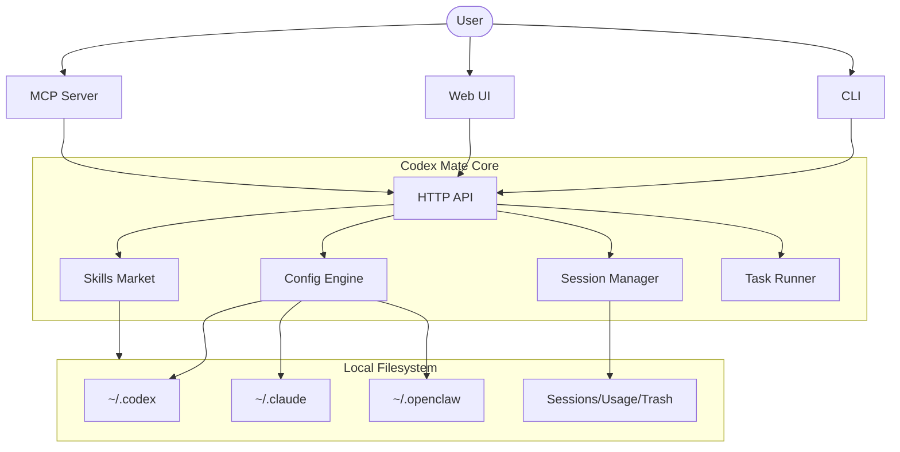

<div align="center">


# Codex Mate

**One dashboard for all your local AI coding agents. Switch providers, manage sessions, and orchestrate tasks across Codex, Claude Code, and OpenClaw. Zero cloud, local-first control plane.**

<p>
  <a href="https://sakurabytecore.github.io/codexmate/">[Documentation]</a>
  <a href="#quick-start">[Quick Start]</a>
  <a href="README.zh.md">[简体中文]</a>
</p>

[](https://www.npmjs.com/package/codexmate)
[](https://www.npmjs.com/package/codexmate)
[](https://github.com/SakuraByteCore/codexmate/stargazers)
[](LICENSE)

<br />


</div>

---

> [!TIP]
> **Local First**: All configurations and sessions are stored in your home directory. No telemetry, no cloud accounts required.

> [!IMPORTANT]
> This project is currently in early stage. We are seeking developers to help build the local agent ecosystem!

## What is Codex Mate?

Have you ever felt overwhelmed by managing multiple local AI agents? Each has its own config format, session storage, and skills directory.

**Codex Mate** offers a unified control plane to bring order to the chaos. It's a local-first CLI + Web UI designed to manage [Codex](https://github.com/openai/codex)、[Claude Code](https://github.com/anthropic-ai/claude-code) and [OpenClaw](https://github.com/moeru-ai/openclaw) seamlessly.

### What's So Special?

Unlike simple wrappers, Codex Mate acts as a **Local Agent Bridge**:
- **Unified Session Browser**: Search and export sessions across all tools in one place.
- **OpenAI-Compatible Bridge**: Use Codex with any OpenAI-compatible UI by normalizing the Responses API.
- **Skills Marketplace**: A local-first market to share and import skills between different agent apps.
- **Task Orchestrator**: Plan and execute complex tasks with dependency tracking.

---

## Current Progress

| Feature | Status | Description |
| --- | --- | --- |
| **Provider Management** | ✅ | Switch providers/models for Codex, Claude, and OpenClaw |
| **Session Browser** | ✅ | List, filter, and export sessions (Codex/Claude/Gemini) |
| **Usage Analytics** | ✅ | Visualize message trends and top projects |
| **Local Skills Market** | ✅ | Cross-app import/export of agent skills |
| **Task Queue** | ✅ | DAG-based task execution and logs |
| **OpenAI Bridge** | ✅ | Convert Codex Responses API to standard OpenAI format |
| **Prompt Templates** | ✅ | Reusable prompt plugins with variables |
| **MCP Integration** | ✅ | Expose local tools and resources via MCP stdio |
| **Auto Update** | ✅ | Quick update CLI via `codexmate update` |

---

## Quick Start

### Install via npm

```bash
npm install -g codexmate
codexmate setup
codexmate run
```

### Install via curl (Standalone)

```bash
curl -fsSL https://raw.githubusercontent.com/SakuraByteCore/codexmate/main/scripts/install.sh | bash
```

### Supported Agents

- **Codex**: `npm install -g @openai/codex`
- **Claude Code**: `npm install -g @anthropic-ai/claude-code`
- **Gemini CLI**: `npm install -g @google/gemini-cli`
- **CodeBuddy**: `npm install -g @tencent-ai/codebuddy-code`

---

## Architecture



---

## Special Thanks

Special thanks to all contributors for their contributions to Codex Mate ❤️

<a href="https://github.com/SakuraByteCore/codexmate/graphs/contributors">
  
</a>

## Star History

[](https://star-history.com/#SakuraByteCore/codexmate&Date)

## License

Apache-2.0
