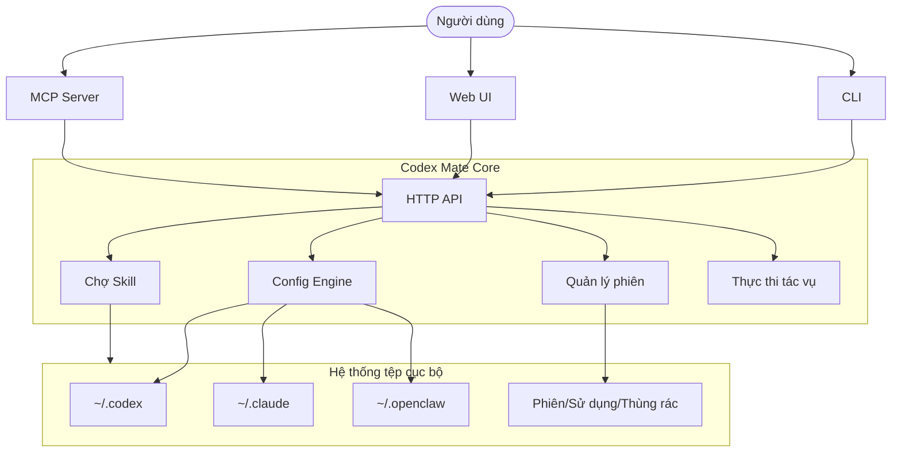

<div align="center">


# Codex Mate

**Một dashboard duy nhất cho tất cả AI coding agent cục bộ của bạn. Chuyển đổi provider, quản lý phiên làm việc và điều phối tác vụ giữa Codex, Claude Code và OpenClaw. Không cloud, trung tâm điều khiển agent hoàn toàn cục bộ.**

<p>
  <a href="https://sakurabytecore.github.io/codexmate/">[Tài liệu]</a>
  <a href="#bắt-đầu-nhanh">[Bắt đầu nhanh]</a>
  <a href="README.md">[English]</a>
  <a href="README.zh.md">[简体中文]</a>
</p>

[](https://www.npmjs.com/package/codexmate)
[](https://github.com/SakuraByteCore/codexmate/actions/workflows/release.yml)
[](https://www.npmjs.com/package/codexmate)
[](#bắt-đầu-nhanh)
[](#bắt-đầu-nhanh)
[](https://nodejs.org/)
[](LICENSE)
[](https://github.com/SakuraByteCore/codexmate/stargazers)
[](https://github.com/SakuraByteCore/codexmate/issues)

<br />


</div>

---

> [!TIP]
> **Ưu tiên cục bộ**: Toàn bộ cấu hình và phiên làm việc được lưu trong thư mục home của bạn. Không có telemetry, không cần tài khoản cloud.

> [!IMPORTANT]
> Dự án đang ở giai đoạn đầu. Chúng tôi đang tìm kiếm các nhà phát triển để cùng xây dựng hệ sinh thái agent cục bộ!

## Codex Mate là gì?

Bạn có bao giờ cảm thấy rối khi phải quản lý nhiều AI agent cục bộ? Mỗi tool lại có định dạng cấu hình, nơi lưu phiên và thư mục skill riêng.

**Codex Mate** cung cấp một trung tâm điều khiển thống nhất để giải quyết sự hỗn loạn đó. Đây là CLI + Web UI ưu tiên cục bộ, được thiết kế để quản lý [Codex](https://github.com/openai/codex), [Claude Code](https://github.com/anthropic-ai/claude-code) và [OpenClaw](https://github.com/moeru-ai/openclaw) một cách liền mạch.

### Điểm nổi bật

Khác với các wrapper đơn giản, Codex Mate hoạt động như một **Agent Bridge cục bộ**:
- **Trình duyệt phiên thống nhất**: Tìm kiếm và xuất phiên làm việc từ tất cả tool trong một nơi duy nhất.
- **Bridge tương thích OpenAI**: Dùng Codex với bất kỳ UI nào hỗ trợ OpenAI bằng cách chuẩn hóa Responses API.
- **Chợ skill cục bộ**: Chia sẻ và nhập skill giữa các app agent khác nhau.
- **Điều phối tác vụ**: Lập kế hoạch và thực thi tác vụ phức tạp với theo dõi phụ thuộc.

---

## Tiến độ hiện tại

| Tính năng | Trạng thái | Mô tả |
| --- | --- | --- |
| **Quản lý Provider** | ✅ | Chuyển đổi provider/model cho Codex, Claude và OpenClaw |
| **Đồng bộ Agent trực tiếp** | ✅ | Giám sát cấu hình & trạng thái Codex/Claude theo thời gian thực |
| **Trình duyệt phiên** | ✅ | Liệt kê, lọc và xuất phiên (Codex/Claude/Gemini) |
| **Phân tích sử dụng** | ✅ | Trực quan hóa xu hướng tin nhắn và dự án nổi bật |
| **Chợ skill cục bộ** | ✅ | Import/export skill giữa các app agent |
| **Hàng đợi tác vụ** | ✅ | Thực thi tác vụ theo DAG và xem log |
| **Bridge OpenAI** | ✅ | Chuyển đổi Codex Responses API sang định dạng OpenAI chuẩn |
| **Mẫu Prompt** | ✅ | Plugin prompt tái sử dụng được với hỗ trợ biến |
| **Tích hợp MCP** | ✅ | Expose tool và resource cục bộ qua MCP stdio |
| **Tự động cập nhật** | ✅ | Cập nhật nhanh qua `codexmate update` |

---

## Bắt đầu nhanh

### Cài đặt qua Homebrew (macOS / Linux)

```bash
brew tap SakuraByteCore/codexmate
brew install codexmate
```

Yêu cầu [Node.js](https://nodejs.org/) (`brew install node` nếu chưa có).

### Cài đặt qua npm

```bash
npm install -g codexmate
codexmate run
```

Nếu cổng mặc định `3737` bận, Codex Mate tự động thử cổng kế tiếp (`3738`, `3739`, ...). Để chỉ định cổng cố định:

```bash
CODEXMATE_PORT=8080 codexmate run
```

Windows PowerShell:

```powershell
$env:CODEXMATE_PORT=8080; codexmate run
```

### Cài đặt qua curl (Standalone)

```bash
curl -fsSL https://raw.githubusercontent.com/SakuraByteCore/codexmate/main/scripts/install.sh | bash
```

### Agent được hỗ trợ

- **Codex**: `npm install -g @openai/codex`
- **Claude Code**: `npm install -g @anthropic-ai/claude-code`
- **Gemini CLI**: `npm install -g @google/gemini-cli`
- **CodeBuddy**: `npm install -g @tencent-ai/codebuddy-code`
- **OpenCode**: xem [tài liệu chính thức OpenCode](https://opencode.ai/)

---

## Kiến trúc



---

## Lời cảm ơn

Cảm ơn tất cả những người đóng góp cho Codex Mate ❤️

<a href="https://github.com/SakuraByteCore/codexmate/graphs/contributors">
  
</a>

## Lịch sử Star

[](https://star-history.com/#SakuraByteCore/codexmate&Date)

## Giấy phép

Apache-2.0
