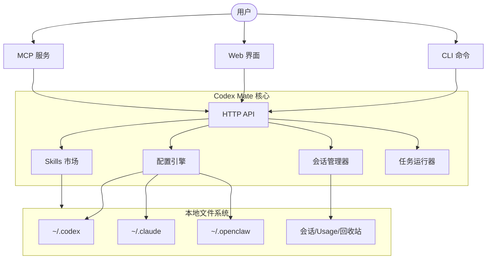

<div align="center">


# Codex Mate

**一站式本地 AI 编程智能体管理面板。统一管理 Codex、Claude Code 与 OpenClaw，支持 Provider 切换、会话管理与任务编排。纯本地优先，你的智能体控制中心。**

<p>
  <a href="https://sakurabytecore.github.io/codexmate/">[项目文档]</a>
  <a href="#快速开始">[快速开始]</a>
  <a href="README.md">[English]</a>
</p>

[](https://www.npmjs.com/package/codexmate)
[](https://github.com/SakuraByteCore/codexmate/actions/workflows/release.yml)
[](https://www.npmjs.com/package/codexmate)
[](#homebrew-安装macos--linux)
[](#快速开始)
[](https://nodejs.org/)
[](LICENSE)
[](https://github.com/SakuraByteCore/codexmate/stargazers)
[](https://github.com/SakuraByteCore/codexmate/issues)

<br />


</div>

---

> [!TIP]
> **本地优先**：所有配置和会话均存储在您的主目录中。无需遥测，无需云端账户。

> [!IMPORTANT]
> 本项目目前处于早期开发阶段。我们正在寻找开发者共同构建本地智能体生态！

## 什么是 Codex Mate?

你是否曾因管理多个本地 AI 智能体而感到疲惫？每个工具都有自己的配置格式、会话存储和 Skills 目录。

**Codex Mate** 提供了一个统一的控制平面，让混乱重归有序。这是一个本地优先的 CLI + Web UI，旨在无缝管理 [Codex](https://github.com/openai/codex)、[Claude Code](https://github.com/anthropic-ai/claude-code) 和 [OpenClaw](https://github.com/moeru-ai/openclaw)。

### 有什么独特之处？

不同于简单的封装，Codex Mate 充当了 **本地智能体桥接器**：
- **统一会话浏览器**：在一个地方搜索并导出所有工具的会话。
- **OpenAI 兼容桥接**：通过归一化 Responses API，让 Codex 能够与任何支持 OpenAI 格式的 UI 配合使用。
- **Skills 市场**：本地优先的市场，支持在不同的智能体应用之间共享和导入 Skills。
- **任务编排器**：支持带有依赖跟踪的复杂任务规划与执行。

---

## 当前进展

| 特性 | 状态 | 描述 |
| --- | --- | --- |
| **Provider 管理** | ✅ | 切换 Codex、Claude 和 OpenClaw 的 provider/model |
| **状态实时同步** | ✅ | 实时感知 Codex/Claude 的配置与运行状态变更 |
| **会话浏览器** | ✅ | 列表、筛选及导出会话 (Codex/Claude/Gemini) |
| **Usage 统计** | ✅ | 可视化消息趋势与热门项目统计 |
| **本地 Skills 市场** | ✅ | 跨应用的智能体 Skills 导入与导出 |
| **任务队列** | ✅ | 基于 DAG 的任务执行与日志查看 |
| **OpenAI 桥接** | ✅ | 将 Codex Responses API 转换为标准 OpenAI 格式 |
| **提示词模板** | ✅ | 支持变量的可复用提示词插件 |
| **MCP 集成** | ✅ | 通过 MCP stdio 暴露本地工具与资源 |
| **自动更新** | ✅ | 通过 `codexmate update` 快速更新 CLI |

---

## 快速开始

### Homebrew 安装（macOS / Linux）

```bash
brew tap SakuraByteCore/codexmate
brew install codexmate
```

需要 [Node.js](https://nodejs.org/)（如未安装可执行 `brew install node`）。

### 通过 npm 安装

```bash
npm install -g codexmate
codexmate setup
codexmate run
```

### 通过 curl 安装 (独立包)

```bash
curl -fsSL https://raw.githubusercontent.com/SakuraByteCore/codexmate/main/scripts/install.sh | bash
```

### 支持的智能体

- **Codex**: `npm install -g @openai/codex`
- **Claude Code**: `npm install -g @anthropic-ai/claude-code`
- **Gemini CLI**: `npm install -g @google/gemini-cli`
- **CodeBuddy**: `npm install -g @tencent-ai/codebuddy-code`

---

## 架构总览



---

## 特别鸣谢

感谢所有贡献者对 Codex Mate 的辛勤付出 ❤️

<a href="https://github.com/SakuraByteCore/codexmate/graphs/contributors">
  
</a>

## Star 历史

[](https://star-history.com/#SakuraByteCore/codexmate&Date)

## 开源协议

Apache-2.0
